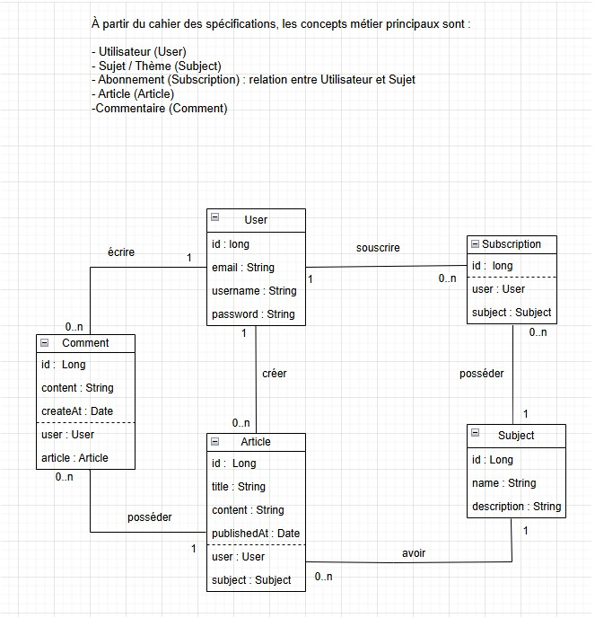
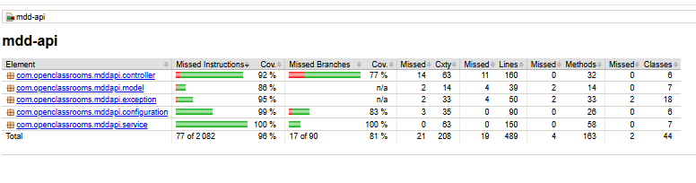
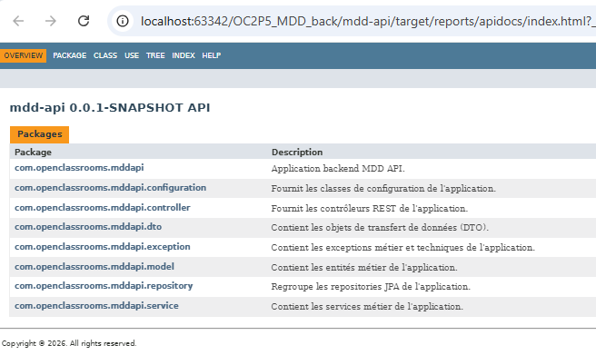
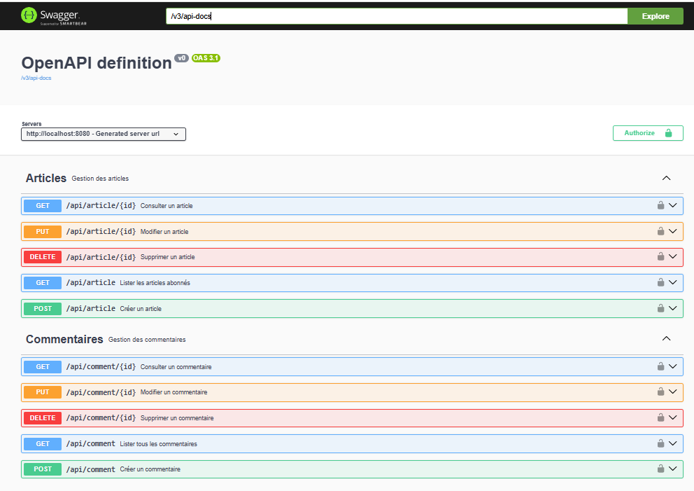

### main
- https://github.com/OpenClassrooms-Student-Center/Developpez-une-application-full-stack-complete.git
- Application ne démarre pas : problème de version java *
- Renseigner  mes répertoires et fichier MyReadme.md dans .gitignore
- git add .
- création de mes répertoires et fichier MyReadme.md
- Renseigner ce fichier.

### dev1
- pom.xml : upgrade version Java en 21 et en Spring-boot 3
- Diagramme UML *
- Implémentation * :  entité : User, Topic, Post, Subscription, Comment
- application.properties : connexion base mysql
- Démarrage OK *

Diagramme UML final :  

### dev2
- Implémentation API Rest : /api/auth/register
- Test sous Postman *
- Vérification table users *

### dev3
- Implémentation API Rest : /api/auth/login
    - ajout dans UserRepository :  Optional<User> findByEmail(String email);
    - ajout deans AuthService :  userRepository.findByEmail(email) .orElse(null) *
- Test sous Postman *

### dev3_ReturnUsername
- /api/auth/login : retourne le Username
  AuthService retourne user au lieu d'un boolean
- Test sous Postman *

### dev4
- Autorisation Cors pour le navigateur  qui veut accéder aux API :
  Access-Control-Allow-Origin : CorsConfig.java

### dev5
- Implémentation affichage d'entête API : RequestLoggingFilter.java
- Autorisation Cors depuis téléphone :  CorsConfig.java :  .allowedOrigins(....,"http://192.168.0.16:4200")

### dev6
- Cryptage ou encodage le mot de passe :
    - SecurityConfig : : @Configuration,@Bean SecurityFilterChain, @Bean passwordEncoder() new BCryptPasswordEncoder()
    - AuthService : register()
- Matcher le mot de passe BCrypt :
    - AuthService : login()

### dev7
- Mise en place JWT simple

### dev8
- Mise en place /api/user/me

### dev9
- /api/auth/register retourne un clé Jwt

### dev10
- /api/auth/register retourne
  sous forme { "token " : kekkekdccf...} et non kekkekdccf.....

### dev11
- Implémentation GET  /api/article

### solution1
Refactorisation des codes.

### solution2
- Tests JUnit
- couverture JaCoCo :  

### solution3  
- Mise en place de JavaDoc  

### main
- Merge
- Extrait de la page Swagger_OpenApi_MDD:  
